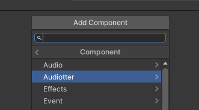
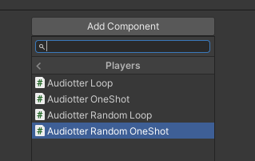
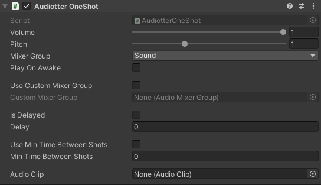

# Audiotter


A Unity fast audio integration framework.

> Developed and tested with Unity 2020.3.16f1 LTS

Basically, this is just a wrapper on top of basic AudioSource functions, but it provides a few high-level features:
* Pre-defined independent Mixer Groups. You can attach your audio components to either "Sound" or "Music" Mixer Group (channel).
* Per-component volume control
* Independent volume control for each of pre-defined Mixer Groups during runtime
* Master volume control
* Custom Mixer Group assignment
* OnAwake playback
* Delayed playback
* Min time between oneshots parameter
* 4 configured components for playback
  - OneShot
  - Random OneShot
  - Loop
  - Random Loop


## Installation
### Option 1
- Open Package Manager through Window/Package Manager
- Click "+" and choose "Add package from git URL..."
- Insert the URL: https://github.com/JottoWorol/Audiotter.git

### Option 2  
Add the following line to `Packages/manifest.json`:
```
"com.jottoworol.audiotter": "https://github.com/JottoWorol/Audiotter.git",
```

## Usage

Right after the installation, Audiotter copies its settings to Assets/Resource folder and the package is ready to use.

To add audio to your game just add one of Audiotter's components. They are lying inside Audiotter/Players menu




### Example of a component added to GameObject



### Volume control
There are separate volume values for Master bus, all Mixer groups and playback components. Range is [0,1f] in each case.

If MasterVolume in Mixer is 0.5 and MusicVolume is 0.5, then the resulting volume is 0.25. The same applies to playback components.

All playback components inherit ```AudiotterPlayerBase```.
```c#
AudiotterMixer.MasterVolume = .9f;
AudiotterMixer.MusicVolume = .6f;
AudiotterMixer.SoundVolume = .8f;

GetComponent<AudiotterPlayerBase>().Volume = .9f;
GetComponent<AudiotterLoop>().Volume = .9f;
GetComponent<AudiotterRandomOneShot>().Volume = .9f;
```


### Pitch control
As in AudioSource, Audiotter components have Pitch parameter. The range is [0,3f].
```c#
GetComponent<AudiotterOneShot>().Pitch = 1.3f;
```

### Delay
Delay is a time between ```Play()``` method call and actual playback. In case of oneshots all calls are scheduled separately.

### Minimal time between shots
This is a feature available in ```AudiotterOneShot``` and ```AudiotterRandomOneShot``` components.
It restricts clip playback if the minimal time since the last playback hasn't passed. It prevents clipping and other unwanted effects in case when some clip is played too frequently.